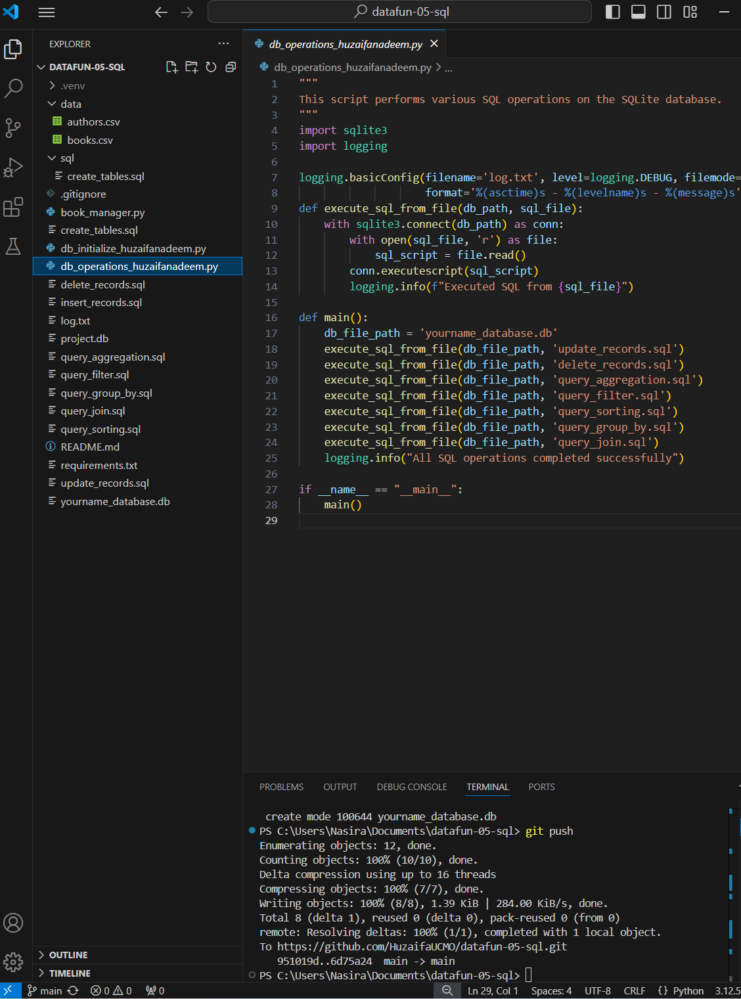
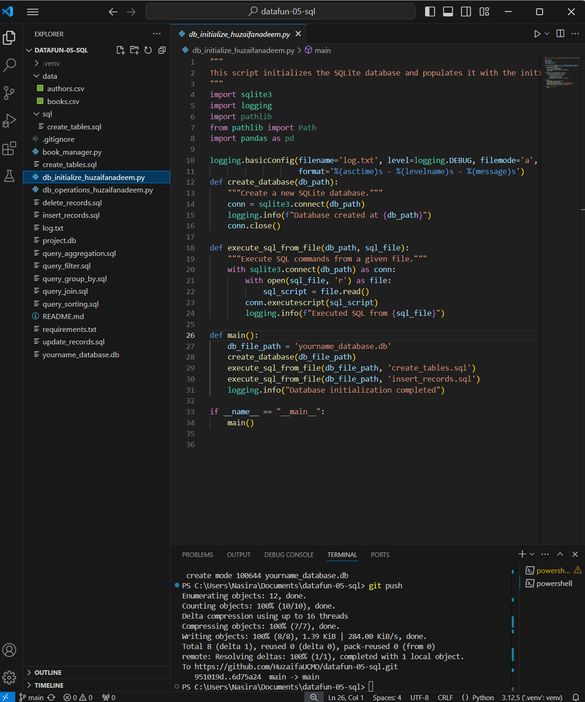
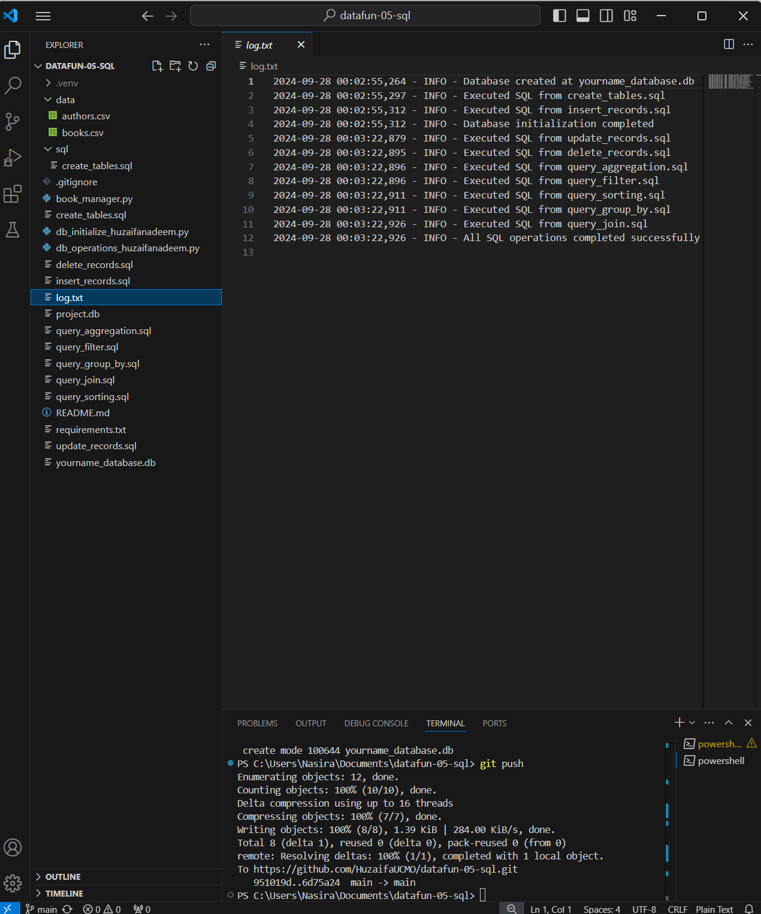

# datafun-05-sql
Project 5: Python and SQL Integration
Overview
This project demonstrates the integration of Python and SQLite for database management, schema creation, and executing complex SQL queries. The project includes creating and managing a database, designing a schema with related tables, and performing various SQL operations such as filtering, joining, and aggregating data. Additionally, it incorporates logging to provide a record of program execution and aid in debugging.

### 1. Initialize the Database

### 2. Operations of the Database

### 3. Log Text File
